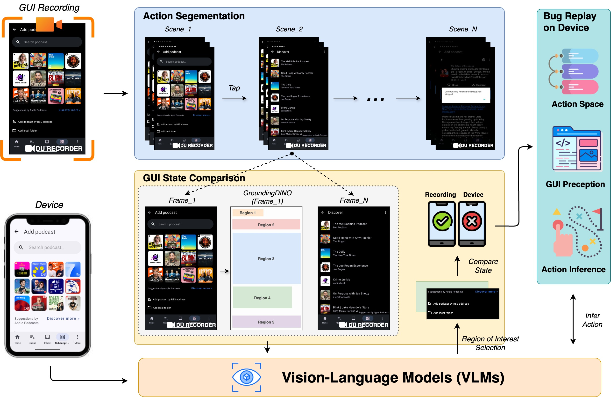

# A Lightweight Bug Replay from Video-based Reports using Vision-Language Models

## Table of Contents
- [Table of Contents](#table-of-contents)
- [Getting Started](#getting-started)
- [Motivation](#motivation)
- [Approach](#approach)
    - [Action Segmentation](#action-segmentation)
    - [GUI State Comparison](#gui-state-comparison)
    - [Bug Replay on Device](#bug-replay-on-device)
- [Evaluation](#evaluation)
    - [RQ1: Performance of Action Segmentation](#rq1-performance-of-action-segmentation)
    - [RQ2: Performance of GUI State Comparison](#rq2-performance-of-gui-state-comparison)
    - [RQ3: Performance of Bug Replay](#rq3-performance-of-bug-replay)

## Getting Started
Bug reports play a critical role in software maintenance by helping users convey encountered issues to developers.
Recently, GUI screen capture videos have gained popularity as
a bug reporting artifact due to their ease of use and ability
to retain rich contextual information.

Inspired by recent advances in Vision-Language
Models (VLMs), like state-of-the-art GPT-4o, we formulates bug reproduction as a multi-modal reasoning problem:
given a recording and the current GUI state, the approach
infers the next actionable step and executes it accordingly.
Specifically, ViBR segments the recording into distinct
user interaction scenes using image-processing techniques;
 employs region-aware VLM-based reasoning to compare
functionally equivalent GUI states between the recording and
the target device; and adaptively infers and replays the
corresponding user actions on the device.

## Motivation

 

Figure: GUI comparison between recording and device.

Despite their growing prevalence of GUI recordings, reproducing bugs from recordings remains challenging process. 
Existing methods often rely on fragile image-processing
heuristics, explicit touch indicators, or pre-constructed UI transition graphs, which require non-trivial instrumentation and app-specific setup. 
As a result, developers often have to manually review the raw footage to infer user actions and the corresponding GUI elements—a process that is both error-prone and time-consuming, particularly when accounting for device differences.

For example, as shown in the Figure, the same folder selection interface
appears with different resolutions, layouts, button placements,
and background themes. Even small variations can hinder
faithful bug reproduction on test devices.

Consequently, developing a lightweight, automated, and robust
approach for replaying bugs from GUI recordings remains a
critical need.

## Approach

 

Figure: The overview of ViBR.

We design ViBR, an automated approach for reproducing bugs
from GUI recordings by segmenting the input video into
user interaction scenes and conditionally replaying each action
based on the current GUI state of the device.

> For more approach details and implementations, please check the instructions in [Approach](./approach)

### Action Segmentation

 

Figure: An illustration of consecutive frame similarity.

While recent work has explored using Vision-Language
Models (VLMs) for video segmentation, these models
struggle with long-term coherence—especially in GUI recordings. To address this limitation, we
adopt a signal processing perspective, treating GUI recordings as sequences of visual frames encoding transitions between user actions. 
That is, we segment the recording into discrete user action scenes by
analyzing visual similarity between consecutive frames.

### GUI State Comparison

 

Figure: The example of prompting GUI state comparison.

GUIs are inherently dynamic. Variations such as pop-up
dialogs, layout shifts, and overlay configurations can introduce
inconsistencies between the recorded environment and the current runtime state. These discrepancies often hinder accurate
bug reproduction, as action scenes may not align with the
live application interface, even on the same device. Therefore,
we aim to verify whether the current GUI state matches the
recorded scene before executing the corresponding user action.
In detail, we propose a region-guided, attention-
based comparison framework that leverages VLMs to assess GUI state consistency with a focus
on functionally relevant interaction targets.

### Bug Replay on Device

 

Figure: The example of prompting bug replay on device.

Once GUI state consistency has been verified, we proceed
to replay the recorded user action on the current device. If
the current GUI state is deemed functionally equivalent to the
recorded one, particularly with respect to the identified Region
of Interest (ROI), the user action can be directly executed on
the current interface. If not, guided exploration is
required to bring the GUI into alignment with the expected
precondition. The overarching goal remains the same: to
navigate the current device screen using VLMs, either with direct guidance
from target actions or through exploration without explicit
context, in order to ultimately reproduce the bug.

## Evaluation

We describe the procedure we used to evaluate ViBR in terms of its performance.

- **RQ1:** How accurate is our approach in segmenting the actions from GUI recordings?
- **RQ2:** How accurate is our approach in determining functional consistency in GUI states?
- **RQ3:** How effective is our approach in replaying the bug on device?

For RQ1, we evaluate the overall performance of our
approach in action segmentation and compare it against state-of-the-art baselines. For RQ2, we assess the effectiveness of
our approach in verifying GUI state consistency, determining
whether the current on-device GUI matches the recorded state
in the action scene. For RQ3, we examine the capability of
our approach to successfully replay bugs on the device.

> For more dataset details and experimental settings, please check the instructions in [Evaluation](./approach/experiment_README.md)

### RQ1: Performance of Action Segmentation

Table: Performance comparison for action segmentation.

Our approach significantly
outperforms all baselines, achieving improvements of 110%
in precision, 56% in recall, and 83% in F1-score over the
best-performing baseline (PySceneDetect). GPT-4o exhibits a
lower performance, with a precision of 0.23, recall of 0.53,
and F1-score of 0.32. 

While GPT-4o demonstrates strong
semantic understanding in many tasks, it struggles with frame-
level segmentation, primarily due to its reliance on high-level
abstraction that lacks the granularity necessary for accurately
identifying scene boundaries—particularly when user actions
involve minor but functionally significant interface changes.

PySceneDetect performs best among the baselines
but remains sensitive to pixel fluctuations and visual noise,
which are common in GUI recordings, such as slight variations
in color rendering, luminance, or anti-aliasing artifacts. This
makes them less robust in handling the visual intricacies of
GUIs compared to our approach, which leverages SSIM to
capture spatial and perceptual differences, thereby offering a
higher level of robustness to visual noise and enabling more
accurate detection of action scenes.

### RQ2: Performance of GUI State Comparison

Table: Performance of GUI state comparison.

Our approach consistently outperforms all baselines,
achieving a 46.7% improvement in precision, 43.8% in re-
call, and 43.5% in F1-score compared to the best-performing
baseline, SSIM. These results demonstrate the strength of
our functionality-aware, VLM-driven comparison method over
traditional visual similarity techniques.

Our ablation study further validates the contribution of
region-guided prompting. The VLM-only variant, which uses
the entire GUI screenshots without localized prompts.
Compared to VLM-only, our approach achieves an improvement of 17.3%, 29.6%, and 21.9% for precision, recall,
and F1-score, respectively.
These improvements demonstrate
the benefit of guiding the model’s attention toward the target
region, especially under visual inconsistencies.

### RQ3: Performance of Bug Replay

Table: Performance comparison for bug replay.

Our approach achieves an average reproducibility
rate of 73.7% within 231.09 seconds, significantly outper-
forming both V2S and GIFdroid. This improvement is largely
due to the robustness of our method against the types of
inconsistencies, such as resolution
mismatches, dynamic UI content, configuration variability, and
recording artifacts. These factors often cause baseline methods
to fail due to their reliance on fragile visual or structural
assumptions.

In addition, a key advantage of our approach lies in its
reduced reliance on auxiliary cues or complete structural
knowledge, harnessing the multi-modal reasoning capabilities of vision-
language models to achieve functionality-aware GUI matching
and robust action inference across diverse device environments
and configurations.