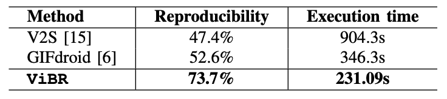

# Evaluation

We provide the experimental setup we used to evaluate ViBR in terms of its performance.

- **RQ1:** How accurate is our approach in segmenting the actions from GUI recordings?
- **RQ2:** How accurate is our approach in determining functional consistency in GUI states?
- **RQ3:** How effective is our approach in replaying the bug on device?

For RQ1, we evaluate the overall performance of our
approach in action segmentation and compare it against state-of-the-art baselines. For RQ2, we assess the effectiveness of
our approach in verifying GUI state consistency, determining
whether the current on-device GUI matches the recorded state
in the action scene. For RQ3, we examine the capability of
our approach to successfully replay bugs on the device.


## Experimental Dataset Collection

To ensure
a diverse and unbiased dataset, we collect recordings from
three existing open-source datasets: (i) the crash bug repro-
duction dataset from Themis; (ii) the evaluation suite of
GIFdroid; and (iii) the study on Android GUI recording
V2S.

You can obtain the dataset in one of the following ways:

- Themis: [https://github.com/the-themis-benchmarks/home](https://github.com/the-themis-benchmarks/home)
- GIFdroid: [https://github.com/sidongfeng/gifdroid](https://github.com/sidongfeng/gifdroid)
- V2S: [https://sites.google.com/view/video2sceneario/home](https://sites.google.com/view/video2sceneario/home) 

Alternatively, you can use our pre-filtered version available at [dataset](./dataset/).


## RQ1: Performance of Action Segmentation

To answer RQ1, we first evaluate
the effectiveness of our approach in accurately
segmenting user action scenes from GUI recordings.
We evaluate segmentation performance using
three standard scene boundary detection metrics: precision,
recall, and F1-score.
For all metrics, a higher value represents better performance.
We compare our method against four state-
of-the-art approach, which are widely used for video segmentation, e.g., 
PySceneDetect, Hecate, TransNetV2, and GPT-4o.

### Setup

**_PySceneDetect_**

1. Requires ffmpeg/mkvmerge for video splitting support. Windows builds (MSI installer/portable ZIP) can be found on the [download](https://www.scenedetect.com/download/) page.

2. Quick install of the tool
```
pip install scenedetect[opencv] --upgrade
```


3. Split GUI recording video on each fast cut using ffmpeg:
```
scenedetect -i <video.mp4> split-video
```

**_Hecate_**
1. Hecate has one dependency: OpenCV library with an FFMPEG support. You will need to install the library!

2. Build the Hecate tool by running the following command:
```
$ git clone https://github.com/yahoo/hecate.git
$ cd hecate
$ vim Makefile.config
 - Set INCLUDE_DIRS and LIBRARY_DIRS to where your 
   opencv library is installed. Usually under /usr/local.
 - If your OpenCV version is 2.4.x, comment out the line 
   OPENCV_VERSION := 3
 - Save and exit
$ make all
$ make distribute
```

3. Check if compile successfully
```
distribute/bin/
```

4. Detect the scene boundary of GUI recording:
```
$ ./distribute/bin/hecate -i <video.mp4> --print_shot_info  --print_keyfrm_info
```


**_TransNetV2_**
1. Install requirements
```bash
pip install tensorflow==2.1
apt-get install ffmpeg
pip install ffmpeg-python pillow
```

> Note `transnetv2-weights` directory contains files in git-lfs.
> You may need to install git-lfs and run `git lfs pull` from the root directory of the repository
> (or you can download `transnetv2-weights` directory manually).

2. Git clone TransNetV2
```
git clone https://github.com/soCzech/TransNetV2.git
python setup.py install
```

3. Infer the scene boundary of GUI recording:
```
python transnetv2.py <video.mp4> [--visualize]
```

**_GPT-4o_**
1. Install requirements
- Python 3.8+
- [OpenAI Python SDK](https://github.com/openai/openai-python)
- `ffmpeg` installed (for video processing)

2. Prepare a GPT API key.

3. Infer the scene boundary of GUI recording:
```
import openai

video_path = "video.mp4"
system_prompt = "You are a helpful assistant that detects user actions in GUI recordings."
query = "Please identify the action scene boundaries where user interactions trigger significant changes in the GUI."
openai.api_key = "your-api-key"

response = openai.ChatCompletion.create(
            model="gpt-4o",
            messages=[
                {"role": "system", "content": system_prompt},
                {"role": "user", "content": query}
            ],
            files=[{"name": path, "file": video_path}]
        )
content = response['choices'][0]['message']['content']
```

### Results

<p align="center">

</p>
<p align="center">Table: Performance comparison for action segmentation.</p>

Our approach significantly
outperforms all baselines, achieving improvements of 110%
in precision, 56% in recall, and 83% in F1-score over the
best-performing baseline (PySceneDetect). GPT-4o exhibits a
lower performance, with a precision of 0.23, recall of 0.53,
and F1-score of 0.32. 

While GPT-4o demonstrates strong
semantic understanding in many tasks, it struggles with frame-
level segmentation, primarily due to its reliance on high-level
abstraction that lacks the granularity necessary for accurately
identifying scene boundaries—particularly when user actions
involve minor but functionally significant interface changes.


PySceneDetect performs best among the baselines
but remains sensitive to pixel fluctuations and visual noise,
which are common in GUI recordings, such as slight variations
in color rendering, luminance, or anti-aliasing artifacts. This
makes them less robust in handling the visual intricacies of
GUIs compared to our approach, which leverages SSIM to
capture spatial and perceptual differences, thereby offering a
higher level of robustness to visual noise and enabling more
accurate detection of action scenes.


## RQ2: Performance of GUI State Comparison

To address RQ2, we evaluate the
effectiveness of our method
in accurately determining functional consistency between the
GUI state in each action scene and the current on-device GUI.
Unlike existing datasets that focus on static screen similarity,
our evaluation emphasizes functionality-aware comparison,
e.g., determining whether the one GUI can support the same
user interaction as the other, even if the appearance differs.
We adopt the same evaluation metrics: precision, recall, and F1-score.
We compare our method against three commonly used image comparison techniques, including one pixel-
level (absolute differences ABS), one structural-level
(SIFT), and one hybrid (SSIM).


### Setup

1. Install dependencies
```
pip install opencv-python scikit-image numpy
```

2. Infer the GUI state comparison using different methods, ABS, 
```
python experiment.py GUI1.jpg GUI2.jpg <method>
```

### Results

<p align="center">

</p>
<p align="center">Table: Performance of GUI state comparison.</p>

Our approach consistently outperforms all baselines,
achieving a 46.7% improvement in precision, 43.8% in re-
call, and 43.5% in F1-score compared to the best-performing
baseline, SSIM. These results demonstrate the strength of
our functionality-aware, VLM-driven comparison method over
traditional visual similarity techniques.

Our ablation study further validates the contribution of
region-guided prompting. The VLM-only variant, which uses
the entire GUI screenshots without localized prompts.
Compared to VLM-only, our approach achieves an improvement of 17.3%, 29.6%, and 21.9% for precision, recall,
and F1-score, respectively.
These improvements demonstrate
the benefit of guiding the model’s attention toward the target
region, especially under visual inconsistencies.


## RQ3: Performance of Bug Replay

To answer RQ3, we evaluate the
ability of our approach to effectively replay
bugs on real devices using GUI recordings. 
We evaluate performance using two metrics:
reproducibility and execution time.
We compare our approach against two state-
of-the-art bug replay techniques, V2S and GIFdroid.

### Setup

**_V2S_**

1. Install prerequisites
* Python 3.6.9 installed
    * Newer versions will not work with required version of TensorFlow.
    * If none installed yet, can use Anaconda/Miniconda as mentioned below
* git (with git lfs) installed
    * If not already existing in your installation of git, here are [git lfs installation instructions](https://help.github.com/en/github/managing-large-files/installing-git-large-file-storage)
* adb installed
    * [instructions](https://developer.android.com/studio/command-line/adb)
    * After installing, be sure to add the executable's path to your v2s configuration file.
* Enable USB debugging on your physical device/emulator
    * [instructions](https://developer.android.com/studio/debug/dev-options)

2. V2S installation
* Ensure that the environment you are running in is operating with Python 3.6.9.
* Current Option:
    * Clone the repository [here](https://gitlab.com/SEMERU-Code/Android/Video2Sceneario/-/tree/v2s-python), navigate to python_v2s directory, and execute `pip install .`. To find auxilary files necessary for running v2s, navigate to the path specified by `sys.prefix` and find v2s.
    * Run `pip show v2s` to ensure that v2s has been installed and to locate the v2s package on your system. By navigating here, you can find the packages necessary for v2s. To find auxilary files necessary for running v2s, navigate to the path specified by `sys.prefix` and find v2s.
* To be implemented at a later date:
    * `pip install v2s`

3. Replay the video
* Update v2s_config.json to list all of the video scenarios to be analyzed, or create a new configuration file following this same structure and specify the path with the `--config` option. Ensure that the detection models are correct depending on your device and that the application name is found in the app_config.json file.
* If necessary, update device_config.json to include your device specs, and update app_config.json to include the application apk and package information. The commands to determine the specs are as follows:
    * device - `adb shell getevent -t`
    * max_x, max_y - `adb shell getevent -lp`
    * width, height - `adb shell wm size`
    * X, Y, EV_ABS, X, Y, PRESS, TRACK_ID, MAJOR, EV_SYN, EV_KEY - `adb shell getevent -t` and `abd shell getevent -lt`
* When you are ready to complete the analysis, run `exec_v2s --config=<filename>` where `<filename>` is the path to the json configuration file listing all of the video scenarios to be analyzed. If no config argument is specified, the default v2s_config.json file is used, which is located at `sys.prefix` with the v2s package. In order to create your own config files, follow the structure outlined in v2s_config.json by including those fields.


**_GIFdroid_**

1. Install prerequisites
* Python 3.6.9 installed

2. GIFdroid installation
* Ensure that the environment you are running in is operating with Python 3.6.9.
* Current Option:
    * Clone the repository [here](https://github.com/gifdroid/gifdroid.git), navigate to gifdroid directory, and execute `pip install -r requirements.txt`. Please make sure you have installed all the requirements.

3. To obtain the UTG, we use Droidbot, please refer [here](https://github.com/honeynet/droidbot/tree/master) for Droidbot installation

4. Replay the video
* Input requirements:
    * video
    * utg: GUI transition graph in json format depicting the screenshots transitions
    * artifact: screenshots in UTG
* When you are ready to complete the installation, run `python main.py --video=<filename> --utg=<utg.json> --artifact=<folder> --out=<out_filename>`.


### Results

<p align="center">

</p>
<p align="center">Table: Performance comparison for bug replay.</p>


Our approach achieves an average reproducibility
rate of 73.7% within 231.09 seconds, significantly outper-
forming both V2S and GIFdroid. This improvement is largely
due to the robustness of our method against the types of
inconsistencies, such as resolution
mismatches, dynamic UI content, configuration variability, and
recording artifacts. These factors often cause baseline methods
to fail due to their reliance on fragile visual or structural
assumptions.

In addition, a key advantage of our approach lies in its
reduced reliance on auxiliary cues or complete structural
knowledge, harnessing the multi-modal reasoning capabilities of vision-
language models to achieve functionality-aware GUI matching
and robust action inference across diverse device environments
and configurations.